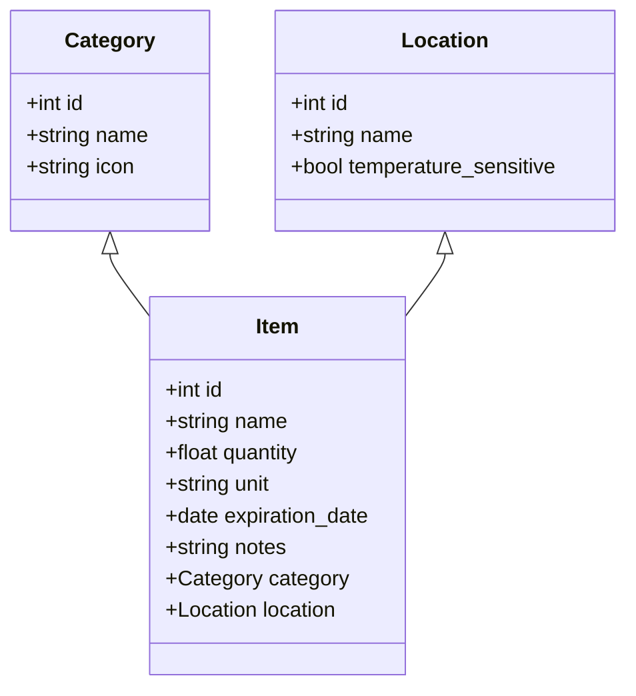

# Diagramme UML – Diagramme de classes

```mermaid
classDiagram
    Category <|-- Item
    Location <|-- Item

    class Category {
        +int id
        +string name
        +string icon
    }

    class Location {
        +int id
        +string name
        +bool temperature_sensitive
    }

    class Item {
        +int id
        +string name
        +float quantity
        +string unit
        +date expiration_date
        +string notes
        +Category category
        +Location location
    }
```
