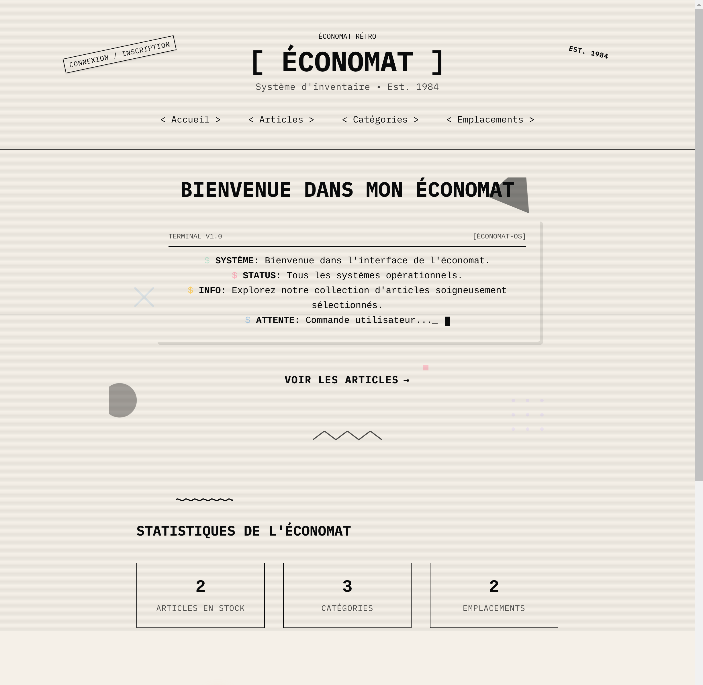
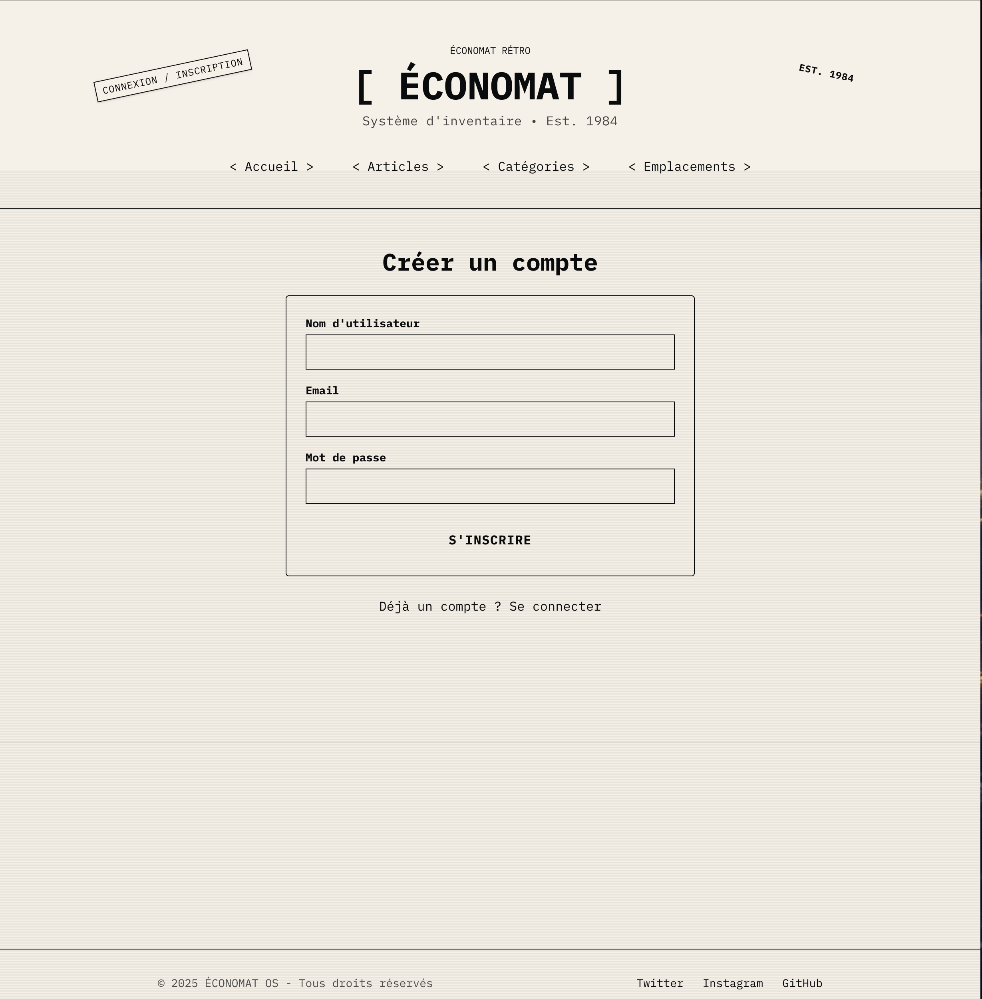
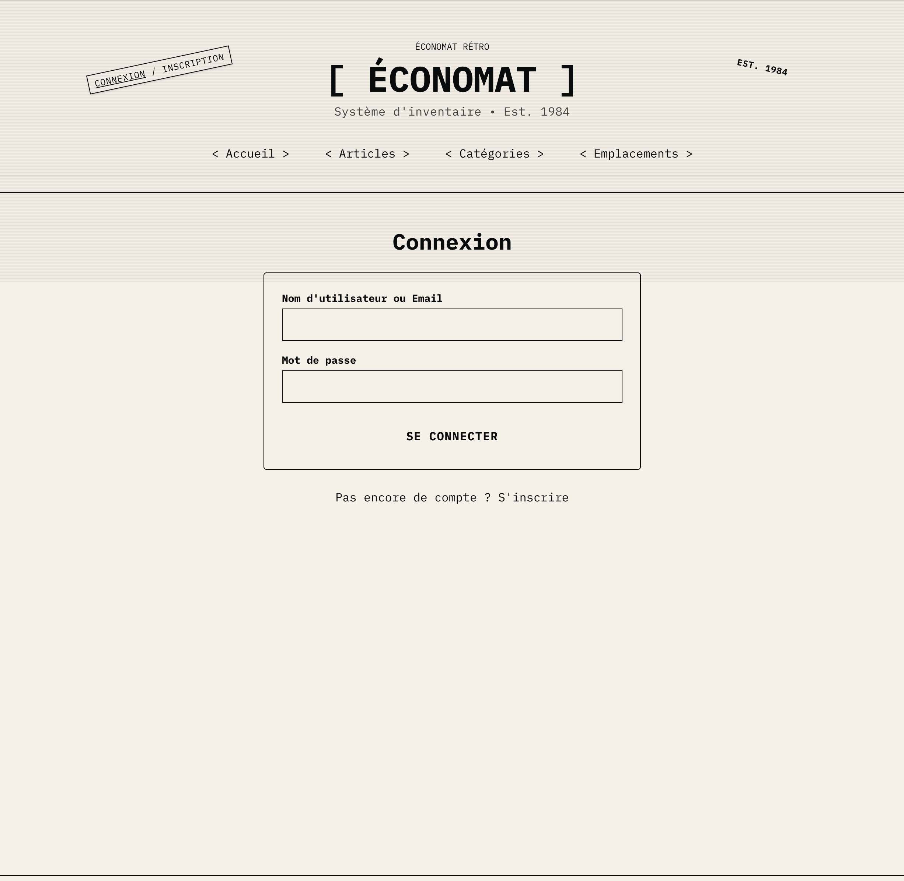
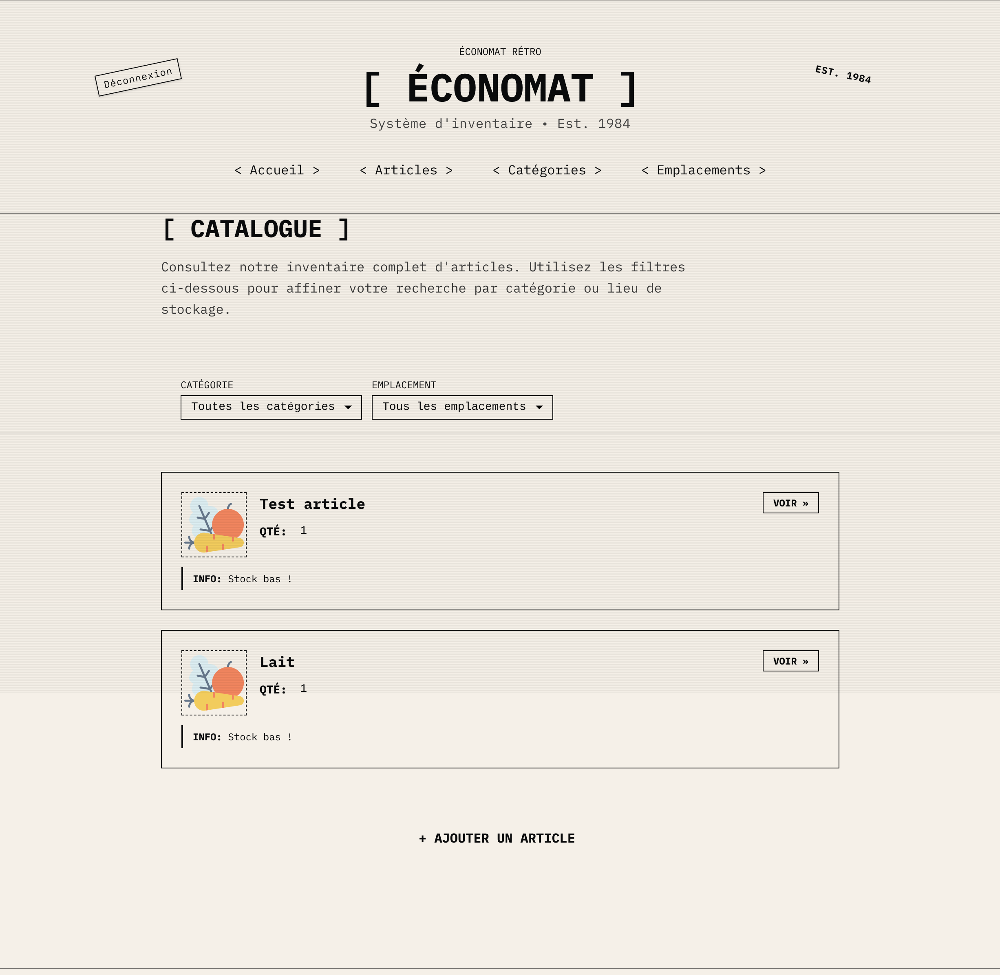
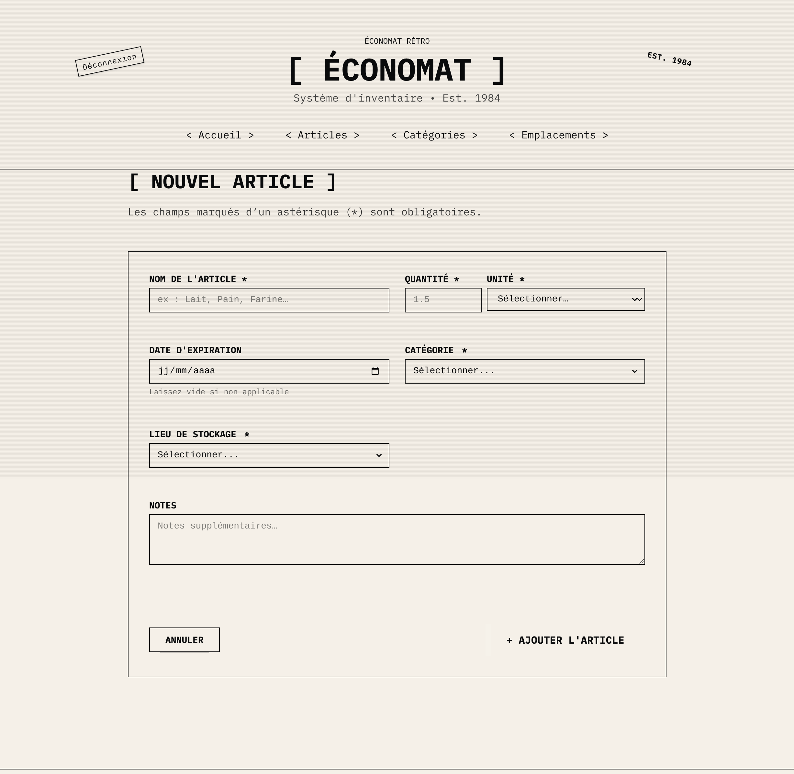
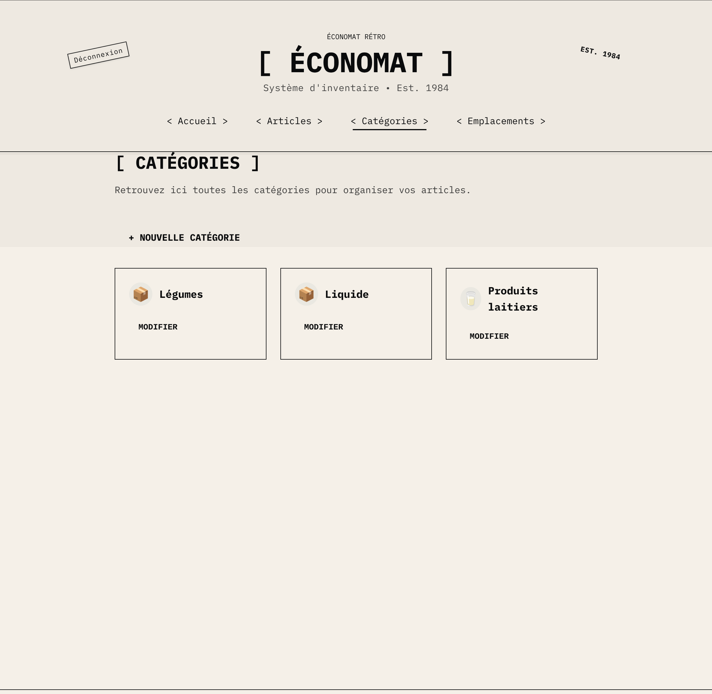
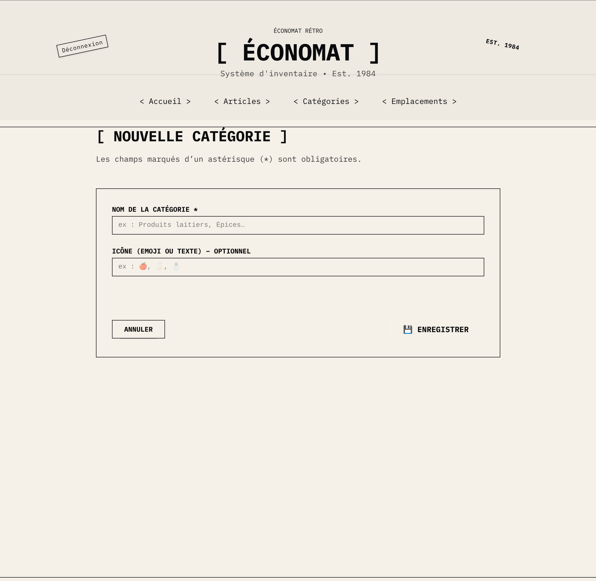
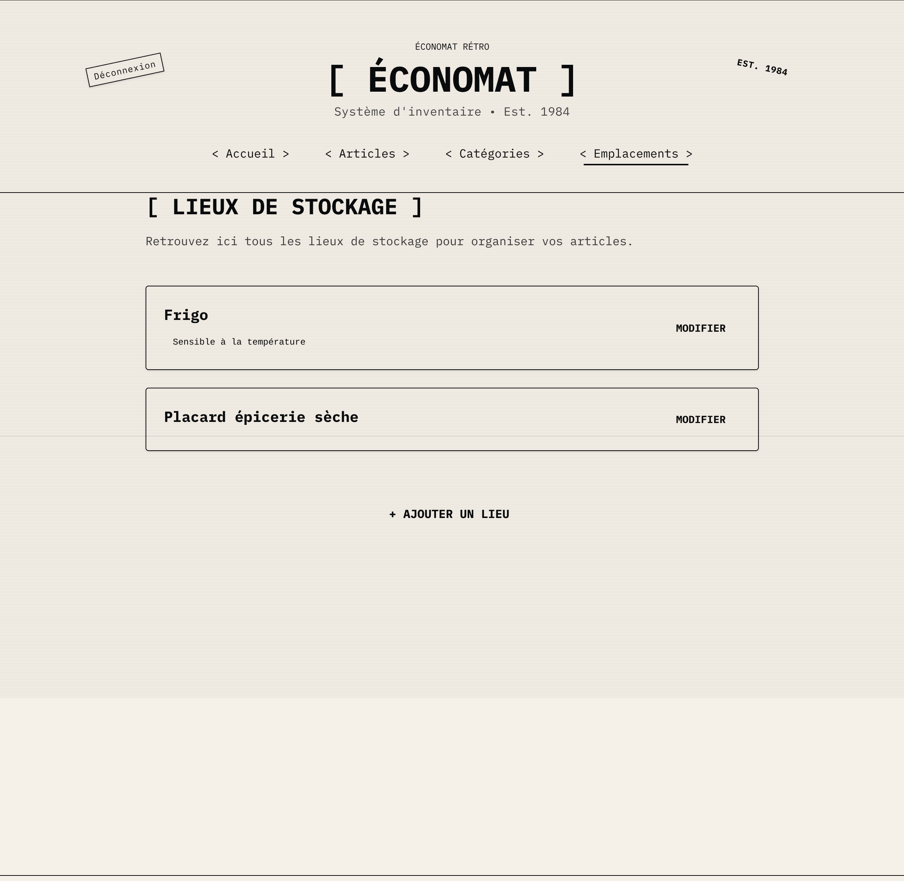
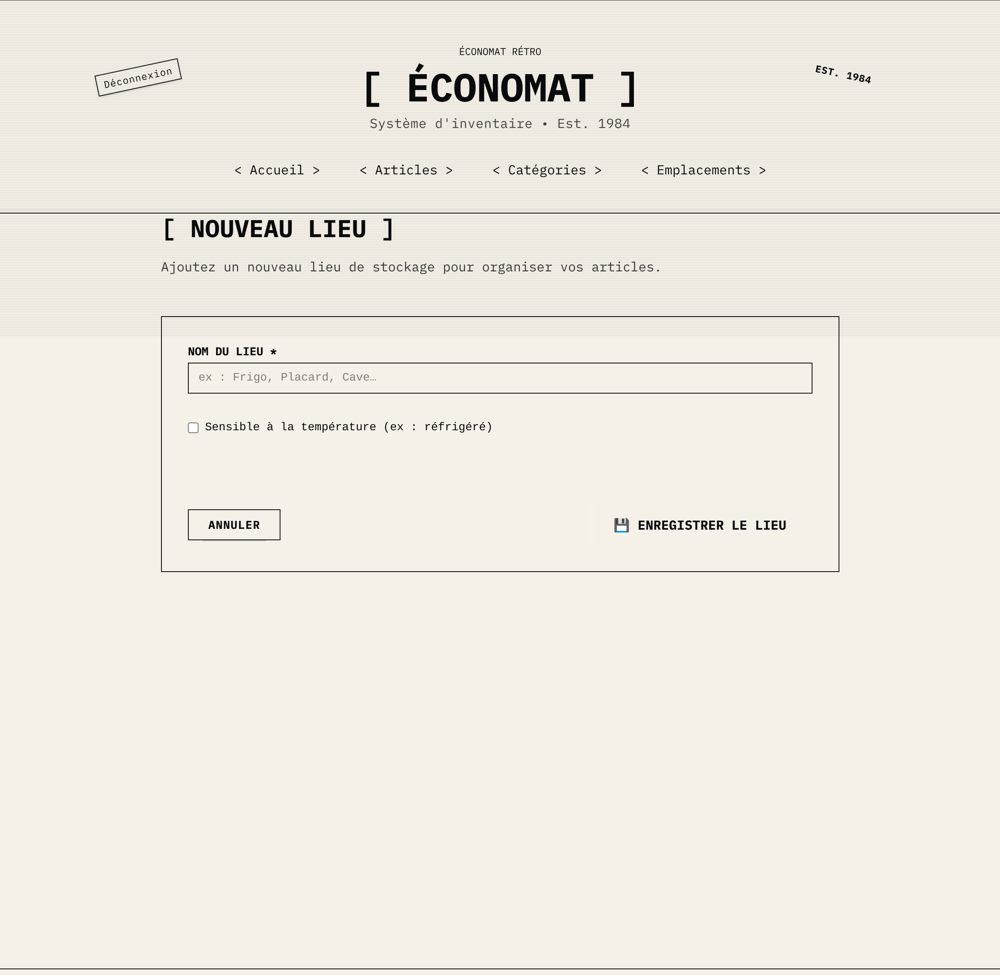

# Projet Astro/Strapi CMS

Une application de gestion de contenu construite avec Astro en front-end et Strapi en back-end, offrant une interface moderne pour la gestion des catégories, items et emplacements.

## Table des matières

- [Installation](docs/INSTALLATION.md) : Intallation du projet
- [Modèle de classes](docs/CLASS.md) : Décrit la structure des entités et leurs relations.
- [Roadmap](docs/ROADMAP.md) : Planification et étapes prévues pour le développement futur.
- [Routes](docs/ROUTES.md) : Liste et description des routes côté back-end exposées par Strapi.
- [Séquence](docs/SEQUENCE.md) : Diagrammes de séquence illustrant les principaux workflows.
- [État](docs/STATE.md) : Diagramme d'état des entités et transitions possibles.
- [Tâches Strapi](docs/STRAPI%20task.md) : Instructions et scripts de gestion des tâches Strapi.
- [Tâches](docs/TASKS.md) : Liste des tâches à accomplir pour le projet.
- [UML](docs/UML.md) : Diagrammes UML globaux du système.
- [Use Cases](docs/USECASE.md) : Cas d'utilisation décrits pour les différents utilisateurs.

## Illustrations de l’interface

### Écran d’accueil

### Page d’inscription

### Écran de connexion

### Liste des items

### Création d’un nouvel item

### Liste des catégories

### Création d’une nouvelle catégorie

### Détail de la localisation

### Ajout d’une nouvelle localisation

## Comment contribuer

Les contributions sont les bienvenues ! Pour proposer des améliorations ou signaler des problèmes :

- Ouvrez une **issue** pour discuter des changements avant implémentation.
- Soumettez une **pull request** en décrivant clairement vos modifications.

Guide de contribution : [CONTRIBUTING.md](CONTRIBUTING.md) (à venir)
