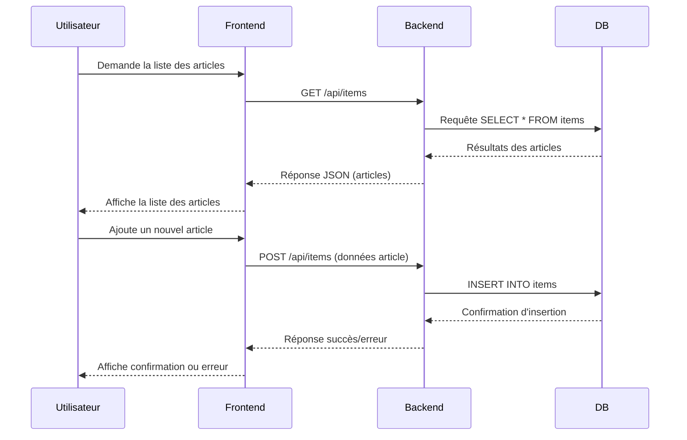

[retour sommaire](../README.md)

# Diagramme UML – Diagramme de séquence

```mermaid
sequenceDiagram
    participant Utilisateur
    participant Frontend
    participant Backend
    participant DB

    Utilisateur->>Frontend: Demande la liste des articles
    Frontend->>Backend: GET /api/items
    Backend->>DB: Requête SELECT * FROM items
    DB-->>Backend: Résultats des articles
    Backend-->>Frontend: Réponse JSON (articles)
    Frontend-->>Utilisateur: Affiche la liste des articles

    Utilisateur->>Frontend: Ajoute un nouvel article
    Frontend->>Backend: POST /api/items (données article)
    Backend->>DB: INSERT INTO items
    DB-->>Backend: Confirmation d'insertion
    Backend-->>Frontend: Réponse succès/erreur
    Frontend-->>Utilisateur: Affiche confirmation ou erreur
```
