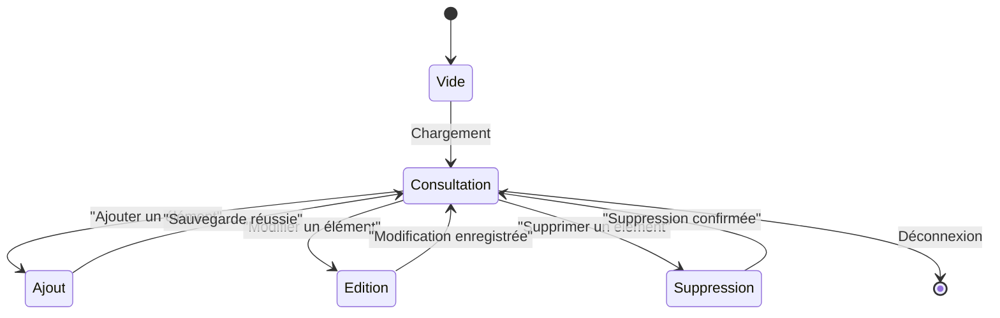

[retour sommaire](../README.md)

# Diagramme UML – Diagramme d'états (State Diagram)

```mermaid
stateDiagram-v2
    [*] --> Vide
    Vide --> Consultation : Chargement
    Consultation --> Ajout : "Ajouter un élément"
    Consultation --> Edition : "Modifier un élément"
    Consultation --> Suppression : "Supprimer un élément"
    Ajout --> Consultation : "Sauvegarde réussie"
    Edition --> Consultation : "Modification enregistrée"
    Suppression --> Consultation : "Suppression confirmée"
    Consultation --> [*] : Déconnexion
```
