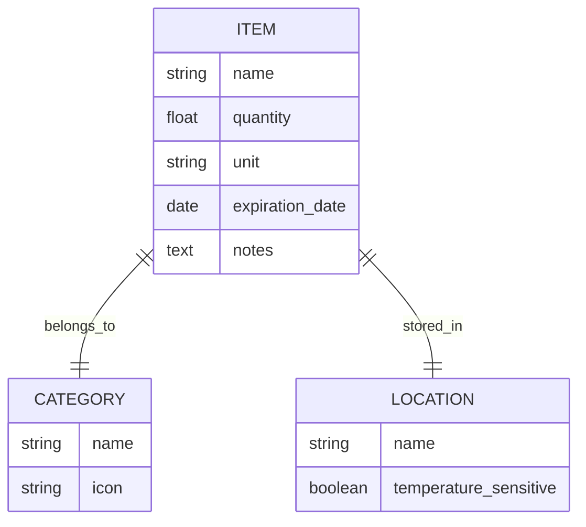

[retour sommaire](../README.md)

# Diagramme UML – Application de gestion d’économat

```mermaid
erDiagram
    ITEM ||--|| CATEGORY : belongs_to
    ITEM ||--|| LOCATION : stored_in

    CATEGORY {
        string name
        string icon
    }

    LOCATION {
        string name
        boolean temperature_sensitive
    }

    ITEM {
        string name
        float quantity
        string unit
        date expiration_date
        text notes
    }

    
```
